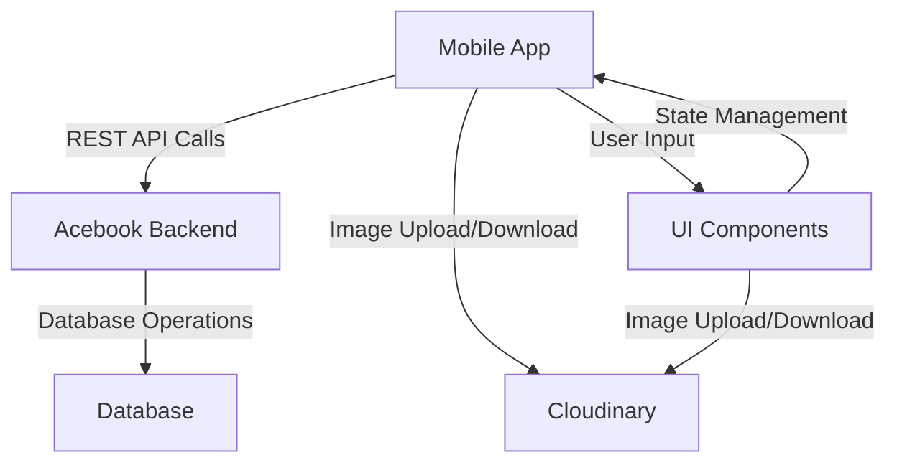
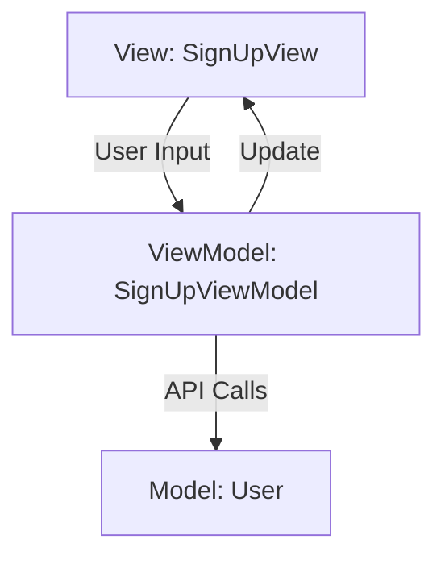
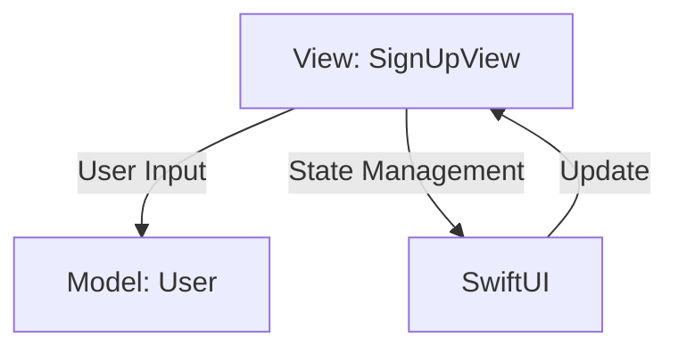
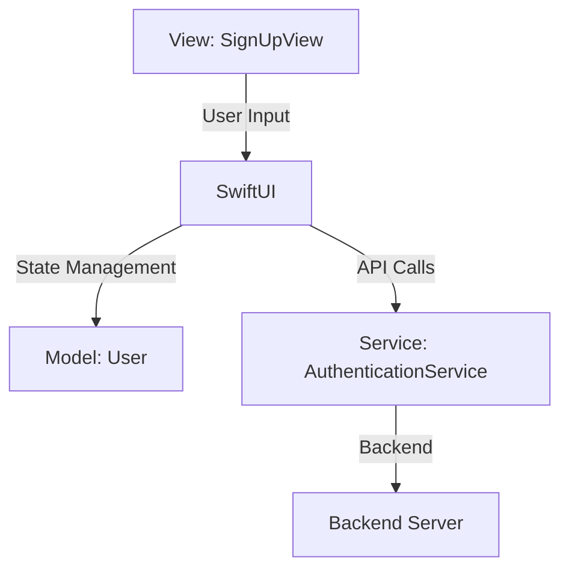

# SwiftUI Project

As part of this project, you will create a new SwiftUI app that integrates with
[this Acebook backend](https://github.com/makersacademy/Mobile-Acebook-backend).

## Introduction

You will work in teams throughout the week. 

Whether you have developed Acebook on Ruby on Rails, Node or MERN, it does not
really matter.

Acebook is your existing backend, and one of the key objectives from this module
is to create a mobile app that integrates with an existing backend, and that is
exactly what you will be doing.

By the end of this week, you should feel more comfortable creating a SwiftUI app
from the scratch that integrates with an existing backend.

Your coach will announce the teams in Slack after the kickoff.

## Learning Objectives

These are the more granular learning objectives that will be covered as part of
this module:
- Develop multi-view SwiftUI applications.
- Design your own iOS app mockups using Sketch (a highly popular and
  conventional choice in the iOS dev community).
- Integrate a SwiftUI app with an existing backend using RESTful APIs.
- Implement advanced SwiftUI components like List views, sheets, Alerts and even
  custom structs to enhance the user interface.
- Manage complex states using SwiftUI annotations such as @State and @Binding
  (for data binding and state management).
- Handle networking errors and provide user feedback using SwiftUI's built-in
  mechanisms for showing alerts.
- Write tests in Xcode that mock network calls to ensure robustness in the
  frontend / backend integration.

## Prerequisites

These are the prerequisites you need to be aware of in order to work through
this module:

1. You must have Xcode installed on your machine.
2. You should have worked through the Acebook project already as part of the
   previous module.
3. You should have worked through the [Swift and SwiftUI Makers Fundamentals
   module](https://github.com/makersacademy/swift-and-swiftui).

## High-level architecture

In this architecture:
- The Mobile App communicates with the Acebook Backend through REST API calls.
- From the Mobile App, we can then upload or download images to/from Cloudinary.
- The Acebook Backend performs database operations.
- UI Components in the Mobile App take user input and manage it through state
  management within the app itself.

## Design patterns in iOS development

In iOS development, two commonly used design patterns are MVC
(Model-View-Controller) and MVVM (Model-View-ViewModel).

In this project, we'll be using a variation of MVC, often referred to as "MVC
without the C".

This approach is particularly useful for smaller apps where a separate
controller layer might add unnecessary complexity.

### MVC without the C vs MVVM

**MVVM**: In MVVM, the ViewModel acts as a mediator that handles the logic for
   the View.

This could be an example diagram to include the Sign Up functionality in our app
using MVVM:

**MVC without the C**: In this pattern, the Model and View are the primary
   actors. SwiftUI takes on the role of the Controller, managing state and
   handling user interactions.

And this one uses MVC without the C:

### Why MVC without the C?

- Simplicity: For smaller apps, the controller can be an unnecessary layer of
  complexity.
- SwiftUI's Declarative Syntax: SwiftUI's design encourages you to write
  declarative code, which eliminates the need for a separate controller in many
  cases.
- State Management: SwiftUI provides built-in state management tools, reducing
  the need for a controller to manage state.

### And where should my logic live?

That is a great question! At this point you may be thinking that your logic to
interact with the backend and other pieces should live in your different views
(e.g. `SignUpView`...).

You could do that, but this goes a bit against the SRP (Single Responsibility
Principle).

A common way of abstracting this logic from the app views is using **Services**.

A service is a specialised class or module that encapsulates a specific
functionality or logic, often related to external interactions like API calls,
database operations, or third-party services.

Services are designed to be reusable and testable, adhering to the SRP. They act
as a bridge between your app's frontend (Views) and backend, handling tasks like
data fetching, data transformation, and error handling.

An example diagram could be:

:information_source: Have a look at the scaffolded app and this should make even
more sense after you do that.

<!-- OMITTED -->

## Getting Started

Follow these steps to get started *swiftly* :grimacing:

1. Fork and clone this repository to your machine.
2. In your teams, make a copy of [this Trello board](https://trello.com/b/7i4tk8H0/swiftui-mobile-acebook).
3. Run the tests.
4. Run the app.
5. Sign up for [Sketch](https://www.sketch.com/) (just one member per team, you have a 30-day free trial
   which does not require any card details upfront).
6. Work through the Trello board!

### The Trello board

It is designed quite vaguely on purpose.

We have given you the high-level requirements of what is needed (how much
functionality we need for this week from the original Acebook requirements).

The expectation is that you, as a team, create your own cards and manage your
own board from here. Having worked on Acebook before should make this task
easier, and it will be great practice for your future as software engineers as
well!

### Sketch mockups

For every view you plan to create in your SwiftUI app (e.g. `SignUpView`,
`LogInView`...), before you create these, you must work on your corresponding
mockups first using Sketch.

### Documentation

As part of this module, you will find [a number of pills](./pills/) that should
help you learn concepts in isolation as you encounter them, make sure you keep
referring to these often!

This is a list of concepts (in alphabetical order) you are very likely going to
come across as you develop your SwiftUI app:

- [ ] Adding new packages using Swift Package Manager (SPM)
- [ ] Asynchronous Programming in Swift
- [ ] Closures :anguished:
- [ ] Cloudinary (to store your images)
- [ ] Debugging Techniques in Xcode
- [ ] Dependency Injection
- [ ] Environment variables in Xcode
- [ ] Error Handling in Swift
- [ ] Image Handling
- [ ] Network requests
- [ ] Protocols
- [ ] Testing in Swift

### Adding more features

If you have completed all the tasks in the Trello board, congratulations! :tada:

If you feel comfortable reading the backend source code, you could try to keep
implementing features to try and fully integrate all the existing Acebook
functionality against your existing SwiftUI app.

If you haven't really worked much with Javascript, you can have a chat with your
coach and together come up with some interesting tasks to work on for the rest
of the week.

In any case, make sure you also document your work somehow. It is always a great
idea for your own learning or portfolios!

:information_source: Developers spend most of the time reading code that they
haven't written themselves. If you want an extra challenge, try to understand
what is happening in the backend and grow your understanding of the codebase.

### Resources

- [Getting started with Sketch](https://www.sketch.com/docs/getting-started/)
- [Apple's official SwiftUI docs](https://developer.apple.com/documentation/swiftui/)
- [Hacking with Swift](https://www.hackingwithswift.com/)
- [Stop using MVVM for SwiftUI](https://developer.apple.com/forums/thread/699003)
- [MVC vs MVVM on iOS: Key Differences with Swift Examples](https://www.netguru.com/blog/mvc-vs-mvvm-on-ios-differences-with-examples)

<!-- BEGIN GENERATED SECTION DO NOT EDIT -->

---

**How was this resource?**  
[😫](https://airtable.com/shrUJ3t7KLMqVRFKR?prefill_Repository=makersacademy%2Fswiftui-engineering-project&prefill_File=README.md&prefill_Sentiment=😫) [😕](https://airtable.com/shrUJ3t7KLMqVRFKR?prefill_Repository=makersacademy%2Fswiftui-engineering-project&prefill_File=README.md&prefill_Sentiment=😕) [😐](https://airtable.com/shrUJ3t7KLMqVRFKR?prefill_Repository=makersacademy%2Fswiftui-engineering-project&prefill_File=README.md&prefill_Sentiment=😐) [🙂](https://airtable.com/shrUJ3t7KLMqVRFKR?prefill_Repository=makersacademy%2Fswiftui-engineering-project&prefill_File=README.md&prefill_Sentiment=🙂) [😀](https://airtable.com/shrUJ3t7KLMqVRFKR?prefill_Repository=makersacademy%2Fswiftui-engineering-project&prefill_File=README.md&prefill_Sentiment=😀)  
Click an emoji to tell us.

<!-- END GENERATED SECTION DO NOT EDIT -->
